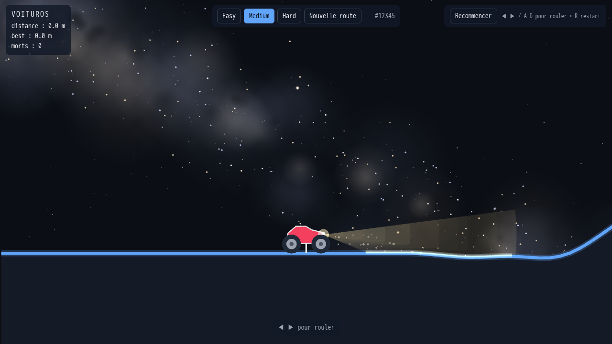

# 🚗 Voituros — roule loin, meurs avec style

**Voituros** est un petit jeu de conduite 2D à la physique délicieusement nerveuse : pilote une voiture low-poly générée aléatoirement sur une route procédurale qui serpente sous une vraie Voie lactée, va le plus loin possible… et évite de finir sur le toit.



## ✨ Pourquoi tu vas aimer

- **Physique crédible qui se ressent** — moteur Rapier 2D à 120 Hz, suspensions à butées, patinage, transferts de charge, sauts et flips : chaque bosse se négocie au doigté.
- **Un phare qui éclaire pour de vrai** — cône de visibilité raycasté en temps réel (56 rayons, ombres exactes derrière les crêtes), atténuation physique, nappe lumineuse sur la chaussée, poussières en suspension et micro-flicker de lampe.
- **Une vraie Voie lactée** — plan galactique projeté en coordonnées J2000 réelles : Triangle d'été, Croix du Nord et étoiles brillantes à leurs positions exactes, Grand Rift, dérive lente + parallaxe.
- **Rejouabilité infinie** — route procédurale seedée + voiture aléatoire (forme, couleur, empattement) à chaque respawn, 3 difficultés (Easy / Medium / Hard).
- **Mort stylish** — retourné plus de 3 s ? Pierre tombale `💀 XX.X m` sur place, best score persisté, nouvelle voiture, on repart.
- **Mobile first-friendly** — joystick tactile transparent en bas à droite sur téléphone.


## 🎮 Contrôles

| Action | Clavier | Mobile |
|---|---|---|
| Avancer | `→` / `D` | Glisser le joystick à droite |
| Reculer | `←` / `A` | Glisser le joystick à gauche |
| Recommencer | `R` | Bouton Recommencer |
| Frein fort | `Espace` | — |


> Astuce : plein gaz, ça décolle — et ce qui décolle finit souvent sur le toit. Dose. 😏

## 🏁 Difficultés

| | Easy | Medium | Hard |
|---|---|---|---|
| Relief | vallonné doux (≤ 20°) | bosses franches (≤ 35°) | murs à 50° |
| Couleur route | 🟢 menthe | 🔵 bleu | 🩷 rose |


## 🚀 Démarrage rapide

Prérequis : **Node ≥ 22**.

```bash
npm install
npm run dev      # → http://localhost:5173
```

```bash
npm run build    # build de prod
npm run preview  # → http://127.0.0.1:4173
npm test         # suite Playwright (9 tests, vrai Chromium)
```

Astuce : `?seed=123&difficulty=hard` dans l'URL pour rejouer (ou partager) une route exacte.


## 🛠️ Sous le capot

- **Rendu** `pixi.js@8` (canvas fullscreen, DPR ≤ 2) · **Physique** `@dimforge/rapier2d-compat` (monde en px, pas fixe 120 Hz + interpolation de rendu, `lengthUnit = 10`) · **Build** `vite` · **Tests** `@playwright/test` (e2e + fluidité + mobile).
- Code découpé en modules ES documentés : `src/route.js` (génération seedée + lissage de courbure), `src/voiture.js` (spec aléatoire, suspension, traction-control à glissement limité, éclairage raycasté), `src/sky.js` (Voie lactée), `src/camera.js` (suivi + lookahead + zoom auto), `src/game.js` (états, tombes, scores).
- Zéro asset externe, zéro alloc par frame dans les boucles chaudes.

Le détail de la spec : voir [`PRD.md`](PRD.md).
