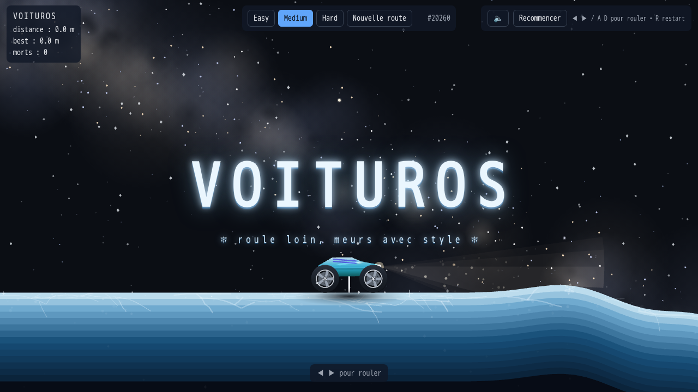
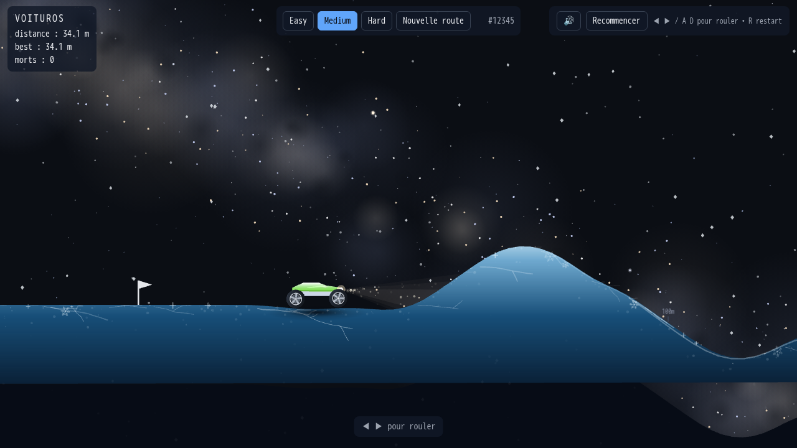
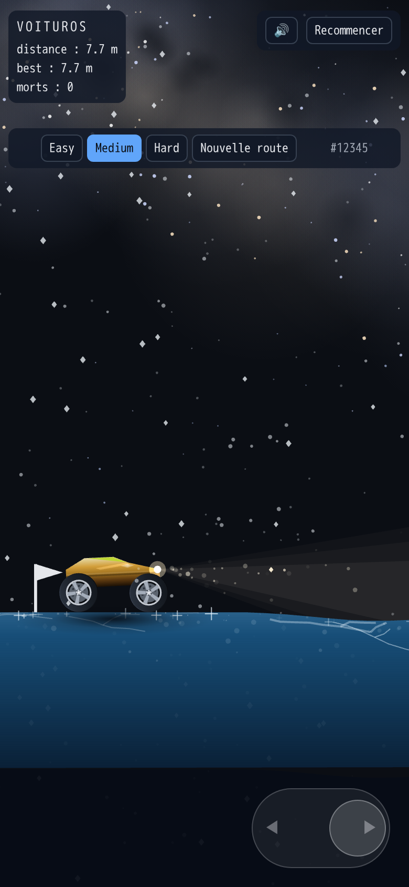
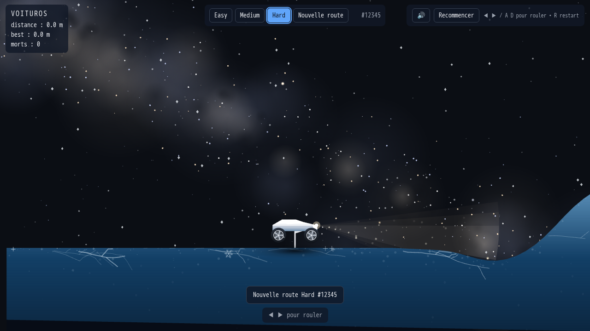
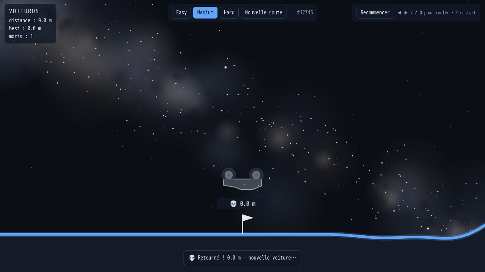

# 🚗 Voituros — roule loin, meurs avec style



**Voituros** est un petit jeu de conduite 2D à la physique délicieusement nerveuse : pilote une voiture low-poly à la peinture unique sur un lac gelé qui serpente sous une vraie Voie lactée, va le plus loin possible… et évite de finir sur le toit.



## 🎮 Contrôles

| Action | Clavier | Mobile |
|---|---|---|
| Avancer | `→` / `D` | Glisser le joystick à droite |
| Reculer | `←` / `A` | Glisser le joystick à gauche |
| Recommencer | `R` | Bouton Recommencer |
| Frein fort | `Espace` | — |
| Son moteur | `M` ou bouton 🔊 | Bouton 🔊 |



> Astuce : plein gaz, ça décolle — et ce qui décolle finit souvent sur le toit. Dose. 😏

## 🏁 Difficultés

| | Easy | Medium | Hard |
|---|---|---|---|
| Relief | vallonné doux (≤ 20°) | bosses franches (≤ 35°) | murs à 50° |



## 🚀 Démarrage rapide

Prérequis : **[Bun](https://bun.sh) ≥ 1.0** (runtime + install ; les tests
Playwright tournent eux sous Node, déjà requis par Playwright lui-même).

```bash
bun install
bun run dev      # → http://localhost:5173
```

```bash
bun run build    # build de prod
bun run preview  # → http://127.0.0.1:4173
bun run test     # suite Playwright sous Node (9 tests, vrai Chromium)
```

> Note : les tests tournent dans Docker en root ; si des fichiers
> `root` apparaissent (`dist/`, `screenshots/`) : `sudo chown -R $USER .`

Astuce : `?seed=123&difficulty=hard` dans l'URL pour rejouer (ou partager) une route exacte.



## 🛠️ Sous le capot

- **Rendu** `pixi.js@8` (canvas fullscreen, DPR ≤ 2) · **Physique** `@dimforge/rapier2d-compat` (monde en px, pas fixe 120 Hz + interpolation de rendu, `lengthUnit = 10`) · **Build** `vite` · **Tests** `@playwright/test` (e2e + fluidité + mobile, via Docker).
- Code découpé en modules ES documentés : `src/route.js` (génération seedée + lissage de courbure), `src/glace.js` (dalle, fissures, cristaux, scintillements), `src/neige.js` (chute écran, vent apparent), `src/voiture.js` (spec aléatoire, suspension, traction-control à glissement limité, éclairage raycasté), `src/peinture.js` (peinture procédurale + reflet, sans contour), `src/engine.js` (son Greenwood, boîte auto 4 rapports), `src/sky.js` (Voie lactée), `src/camera.js` (suivi + lookahead + zoom auto), `src/game.js` (états, tombes, scores).
- Aucune image externe, aucune lib UI, zéro alloc par frame dans les boucles chaudes.

Le détail de la spec : voir [`PRD.md`](PRD.md).
